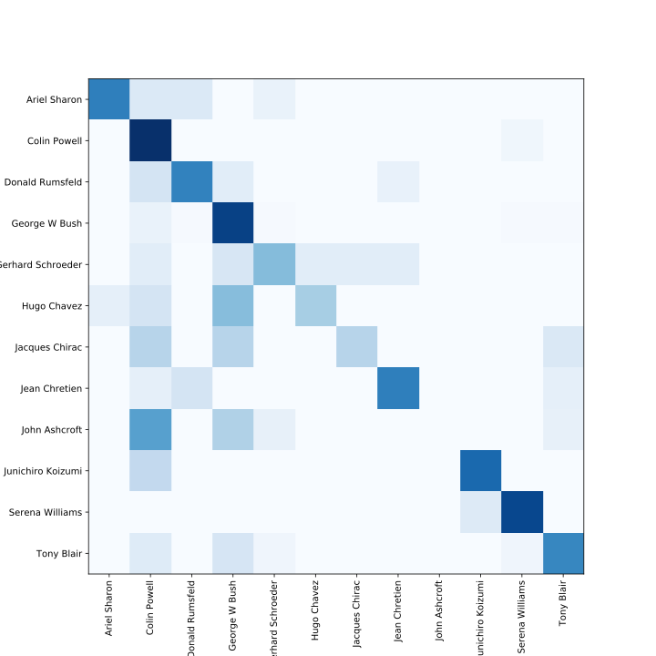

# CapsNet classifier for LFW

A CapsNet network implementing a facial recognition for a LFW and similar data sets.


## Installation

The provided `capsnet` package can be easily installed via PIP:

```python
pip install git+https://github.com/tumido/capsnet-face
```

The package provides binding to a [Kaggle](https://www.kaggle.com) data set, if you desire use it as your data source please install `kaggle` package as well and setup accordingly.

## Generic usage

This package provides multiple objects:

- `CapsNet`, the network class
- `preprocess` function for input data preprocessing
- `fetch_pins_people` a Kaggle [PINS](https://www.kaggle.com/frules11/pins-face-recognition) data set collector with API consistent to the [`fetch_lfw_people`](https://scikit-learn.org/stable/modules/generated/sklearn.datasets.fetch_lfw_people.html)

The package can be used as it by simply invoking:

```python
python -m capsnet
```

This launches the standard training routine over LFW dataset.

## Manual usage

When you desire to experiment with this implementation, please feel free to do so by importing the `CapsNet` class from the installed package. We encourage to explore `help(CapsNet)` to list all methods and arguments possible.

# Model evaluation

There is a [notebooks](notebooks) folder available in this repository. If you would like to know more about the process how the models were trained or evaluated, please feel free to explore these.

## Collected accuracies over multiple runs

| Identities | Data set (images) | Routing iterations | Acc. Train | Acc. Validation | Acc. Test  | Loss   |
| ---------: | ----------------: | -----------------: | ---------: | --------------: | ---------: | -----: |
|         42 |        LFW (2588) |                  1 |      46.2% |           42.5% |      42.5% | 0.5002 |
|         42 |        LFW (2588) |                  3 |      56.4% |           53.7% |      42.5% | 0.3915 |
|         11 |        LFW (1560) |                  1 |      52.6% |           63.2% |      61.5% | 0.2952 |
|         11 |        LFW (1560) |                  3 |      69.3% |           75.0% |      73.7% | 0.2013 |

The trained models are available at [Google Drive](https://drive.google.com/file/d/1--W4YTizYkFQ0H9rOQQapt495512-NIB/view?usp=sharing).

## Visualized activations


## Confusion matrix for the 11 identities model


